# 🏥 ClinixDev — The Cinematic Clinic Operating System

ClinixDev is a high-performance, multi-tenant clinic software-as-a-service (SaaS) platform. The MVP is purpose-built for **veterinary clinics** — owners/patients, appointments, doctor consultations, prescriptions, lab tests, medical documents, inventory, and tax-aware branded invoicing — while the underlying model is **generic (patients + clinic types)** so it scales to dental, general, and specialty clinics over time.

Designed with robust architectural patterns, ClinixDev enforces strict tenant isolation using **PostgreSQL Row-Level Security (RLS)** and **Storage object policies**, writes **compliance-grade audit logs** for sensitive actions, and is engineered as a **HIPAA-ready** architecture for future human clinics.

### Architecture highlights
- **Generic patient model** (`patients` with `patient_type` + `metadata` JSONB) — vet-first, multi-clinic-type ready.
- **Superadmin-only provisioning** — clinics + their admin are created by the platform; public self-serve signup is disabled and routed to **Request Access**.
- **Secure public booking** via a `SECURITY DEFINER` RPC (`submit_public_appointment`) with branch validation + IP rate limiting (no arbitrary `organization_id`/`branch_id` inserts).
- **Branded PDFs** (logo/accent/footer) gated per-clinic by a superadmin `branded_pdfs` feature flag.
- **Labs & documents** in the consultation room; documents are stored behind storage RLS and served via short-lived signed URLs with **audited downloads**.
- **Resend emails** — appointment notifications, invoice receipts, and an automatic **thank-you email** when an invoice is marked paid.

---

## 📸 Platform Tour & Screenshots

Here is a visual overview of the ClinixDev system, captured via automated E2E testing:

### 🌐 Public Portal & Authentication

<details>
<summary><b>1. Gemini-style Animated Landing Page</b></summary>

Polished landing page with floating aurora gradient mesh background, animated counters, typing typewriter, and scroll-triggered animations.
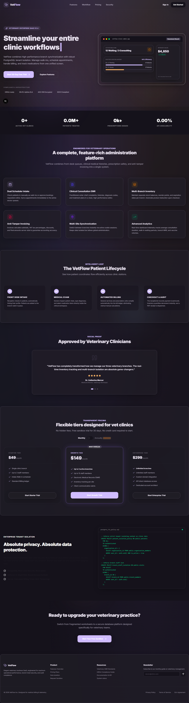
</details>

<details>
<summary><b>2. Authentication Portal</b></summary>

Enforces credentials and routes users dynamically based on role.
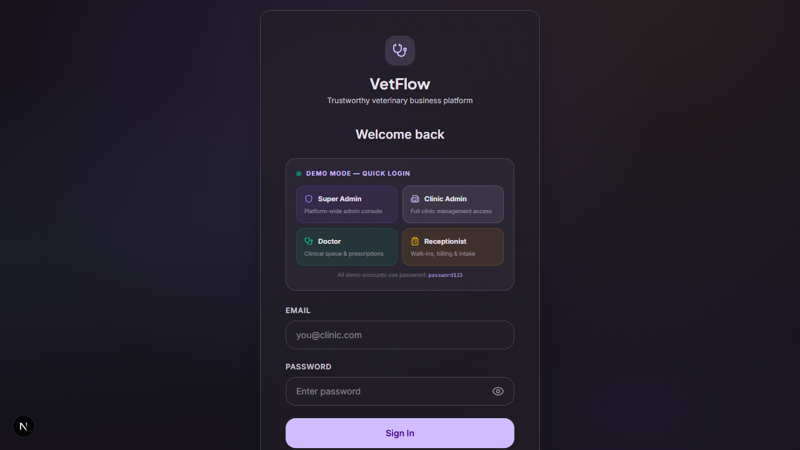
</details>

### 💼 Clinic Administrator Console

The clinic admin possesses full operational management capabilities:

<details>
<summary><b>3. Admin Dashboard Overview</b></summary>

Real-time KPI metrics, active branch indicators, clinical load balancing, and recent patient activity feed.
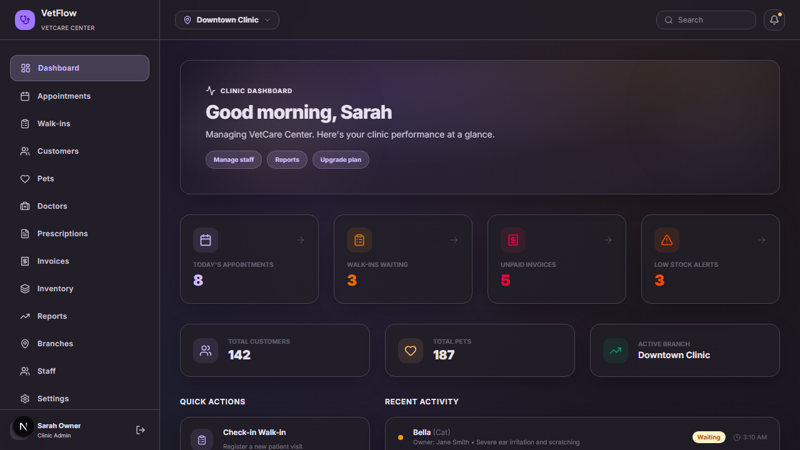
</details>

<details>
<summary><b>4. Appointment Scheduler</b></summary>

Dual-intake planner tracking approved bookings and pending online requests.
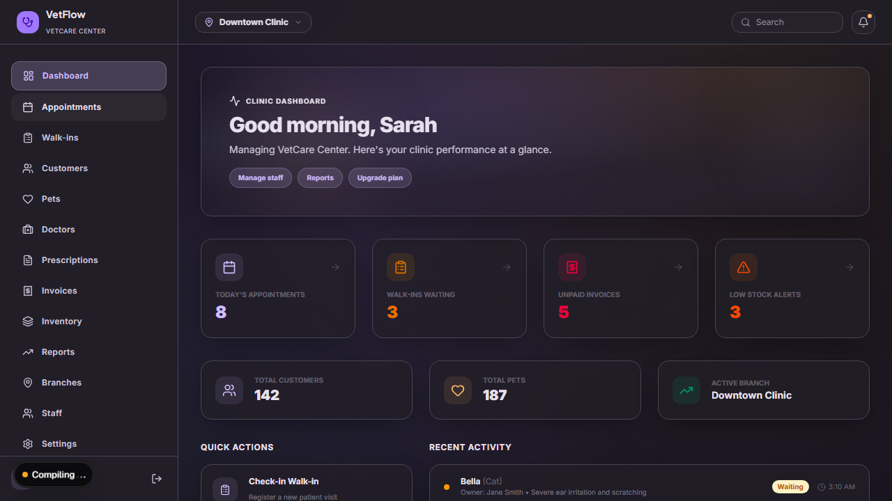
</details>

<details>
<summary><b>5. Walk-in Queue</b></summary>

Active branch intake room, tracking patients currently waiting or in consultation.

</details>

<details>
<summary><b>6. Inventory & Catalog Manager</b></summary>

Multi-branch stock levels tracking, automatic deductions, and adjustment history log.
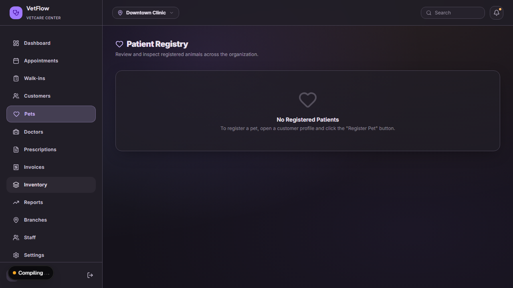
</details>

<details>
<summary><b>7. Billing & Invoices Ledger</b></summary>

Anti-tamper invoicing ledger with VAT, discount computation, and PDF receipt dispatch.
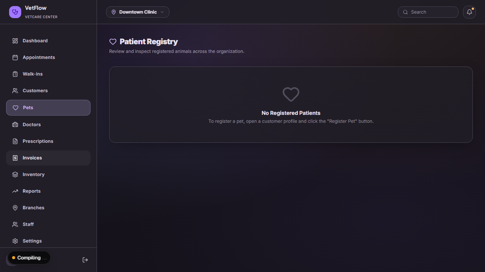
</details>

<details>
<summary><b>8. Customer & Patient Registries</b></summary>

Detailed profiles for owners and patient medical records.

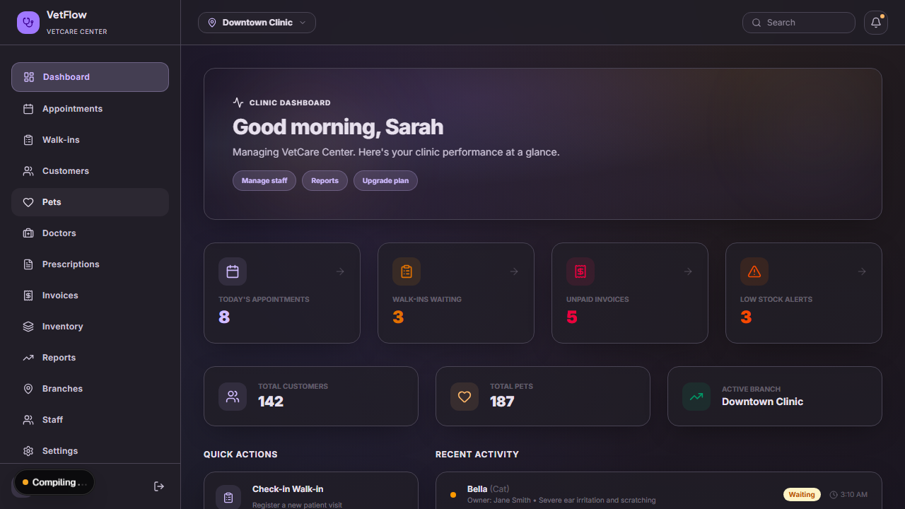
</details>

<details>
<summary><b>9. Prescriptions, Staff, Reports & Settings</b></summary>

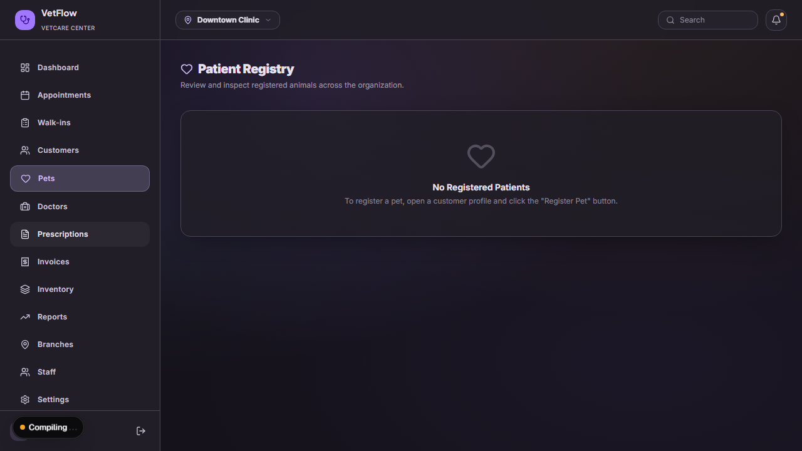
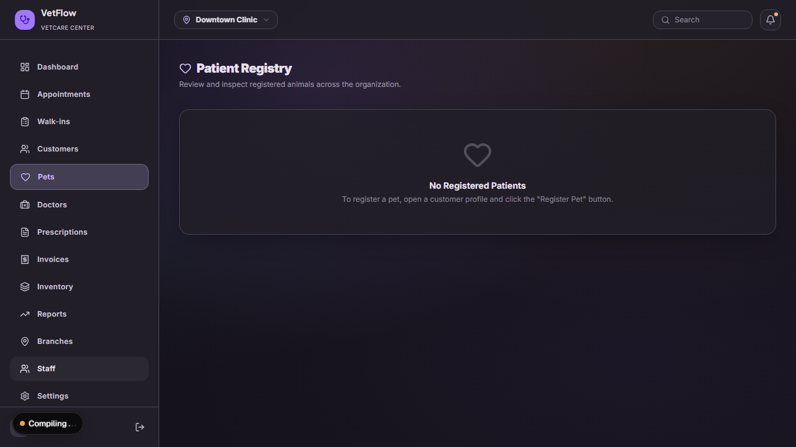
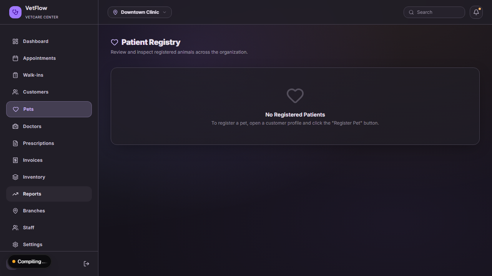
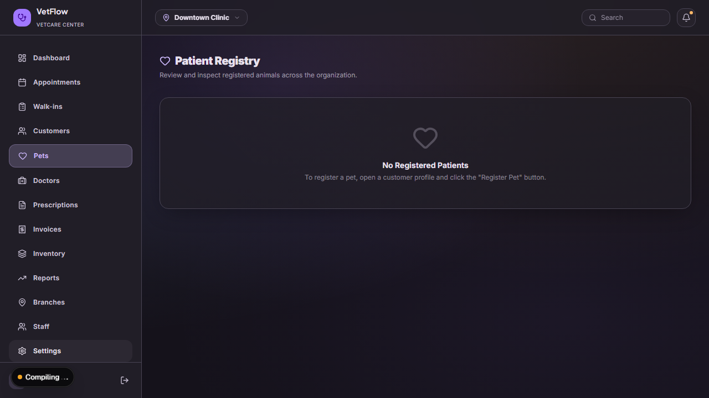
</details>

### 🩺 Attending Practitioner Portal

<details>
<summary><b>10. Attending Doctor Workspace</b></summary>

Queue mapping assigned patients, one-click consult starter, and medical history EMR inputs.
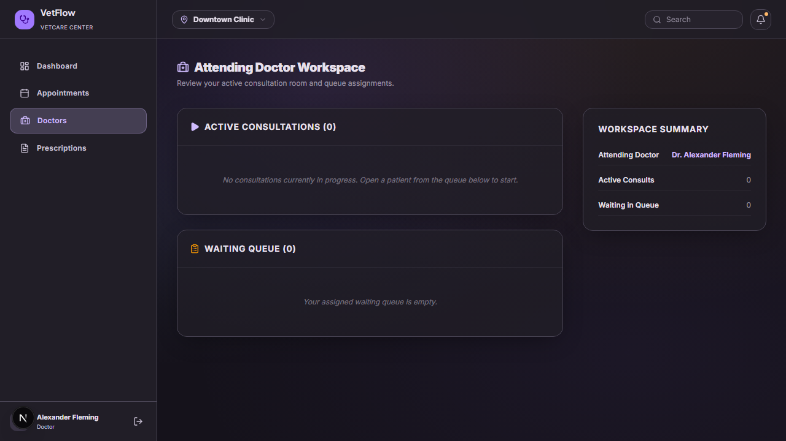
</details>

### 🛎️ Receptionist Desk

<details>
<summary><b>11. Front Desk Receptionist Dashboard</b></summary>

Lightweight check-in, checkout, billing, and queue management interface.
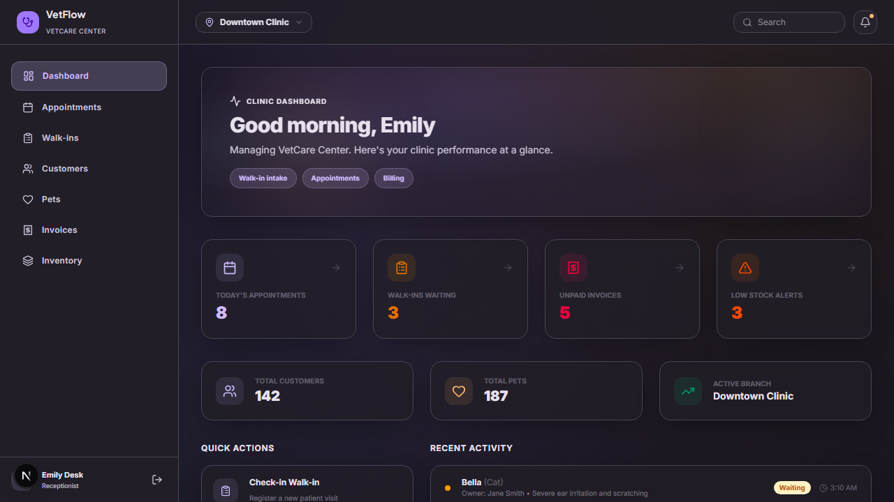
</details>

### 👑 Platform Owner Console

<details>
<summary><b>12. Super Admin Panel</b></summary>

High-level platform performance, subscription logs, and tenant (organization) isolation dashboard.
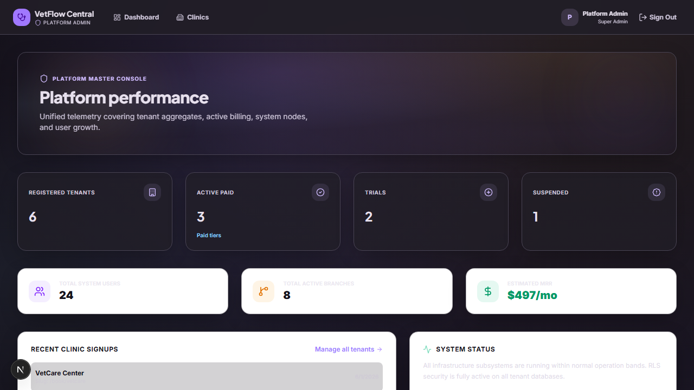
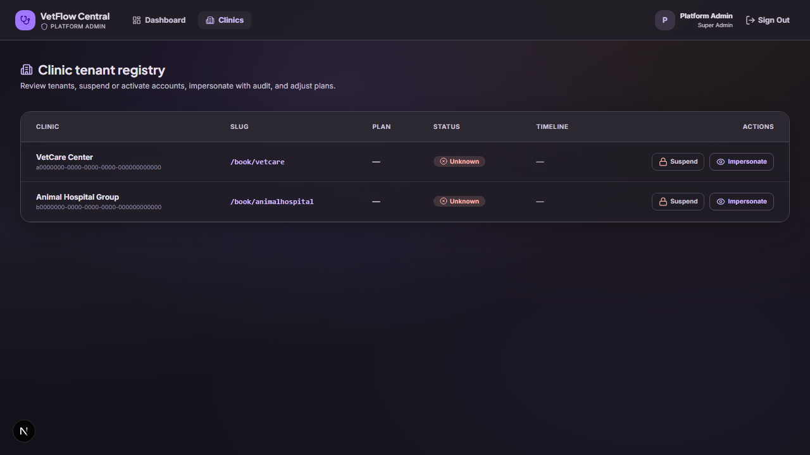
</details>

---

## 🏗️ Architecture & Technical Stack

- **Framework**: [Next.js 16 (App Router)](https://nextjs.org/)
- **Runtime & UI**: [React 19](https://react.dev/), [TypeScript](https://www.typescriptlang.org/), [Tailwind CSS v4](https://tailwindcss.com/)
- **Backend & Auth**: [Supabase SSR Suite](https://supabase.com/docs/guides/auth/server-side-rendering) (PostgreSQL Database)
- **State & Form Validation**: [Zod](https://zod.dev/) & [React Hook Form](https://react-hook-form.com/)
- **E2E Testing & Visuals**: [Playwright Test Suite](https://playwright.dev/)
- **Design Tokens**: Vanilla CSS modern keyframe meshes & glassmorphism utilities

---

## 🔐 Local Testing & Demo Credentials

To run the project locally without setting up a remote Supabase instance, **Demo Mode** can be enabled. In Demo Mode, database queries and login sessions are automatically resolved using in-memory mock-data simulating the multi-tenant branch environments.

Enable Demo Mode by ensuring `.env.local` contains:
```env
NEXT_PUBLIC_DEMO_MODE=true
```

### Mock Accounts

| Role | Email | Password | Allowed View / Path |
|------|-------|----------|---------------------|
| **Super Admin** | `salmanjoyiaa@gmail.com` | `password123` | `/super-admin/dashboard` |
| **Clinic Admin** | `admin.a@vetcare.com` | `password123` | `/dashboard` (All features) |
| **Doctor** | `doctor.a@vetcare.com` | `password123` | `/dashboard` & `/dashboard/doctors` |
| **Receptionist** | `receptionist.a@vetcare.com` | `password123` | `/dashboard` (Front Desk Desk) |

---

## 🚀 Getting Started

### 1. Prerequisites
Ensure you have [Node.js](https://nodejs.org/) installed (v18.x or newer).

### 2. Install Dependencies
```bash
npm install
```

### 3. Install Playwright Browsers
```bash
npx playwright install chromium
```

### 4. Running the Development Server
```bash
npm run dev
```
Open [http://localhost:3000](http://localhost:3000) to view the landing page. Click **Sign In** and enter any credential from the table above.

---

## 🧪 Running E2E Test Suite
The Playwright test suite will automatically spin up the development server, authenticate each role, traverse their dashboards, and capture screens:

```bash
# Run tests headlessly
npm run test:e2e

# Run tests in Playwright's UI Mode
npm run test:e2e:ui
```
Screenshots are outputted directly to the `e2e/screenshots/` directory.
